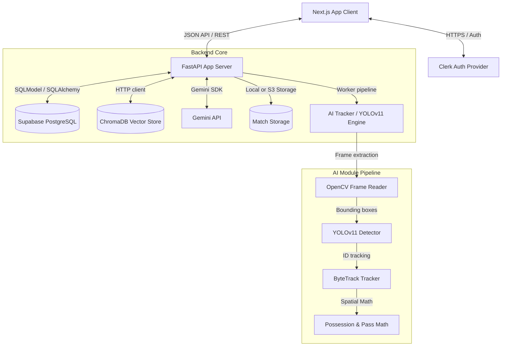

# System Architecture Design

This document details the software design, patterns, and component relationships of the **AI Football Intelligence Platform**.

---

## Component Diagram

---

## Key Design Principles

1. **Clean Architecture (Decoupled Infrastructure)**
   The core domain logic of the application (located under `backend/app/services`) is independent of database adapters, ML libraries, or framework endpoints. We define interfaces so that PostgreSQL or S3 layers can be replaced with minimal friction.

2. **SOLID Design Principles**
   - **Single Responsibility Principle (SRP)**: Each router endpoint delegates all validation to Pydantic, all database transformations to Repository classes, and all business rules to Service classes.
   - **Interface Segregation**: The AI module isolates OpenCV and YOLO specific libraries behind clean wrapper classes (`Detector`, `Tracker`, `Analyzer`), ensuring the web application doesn't bleed computer-vision types.

3. **Multi-Stage Processing (Video Ingestion to Insights)**
   - **Phase 1: Ingestion**: Raw video uploaded -> safe storage on cloud buckets -> Database metadata creation.
   - **Phase 2: Inference**: Video frames run through YOLOv11 & ByteTrack -> tracks generated.
   - **Phase 3: Tactical Computations**: Spatial calculations -> heatmaps, pass vectors, possession matrices.
   - **Phase 4: LLM Coaching Integration**: Tactical data vectorized -> stored in ChromaDB -> Gemini LLM utilizes RAG context to output match feedback.
